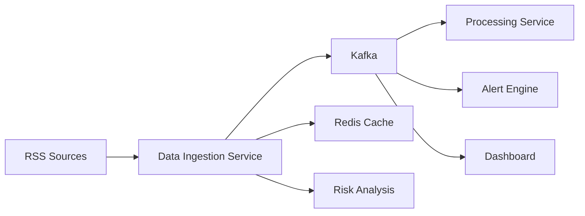

# ConflictRadar Data Ingestion Service

[](https://openjdk.java.net/projects/jdk/21/)
[](https://spring.io/projects/spring-boot)
[](https://www.docker.com/)
[](https://kafka.apache.org/)

> **Mission**: Early warning system for social conflicts through open data analysis

## 🎯 What is this?

**ConflictRadar Data Ingestion Service** is a production-ready microservice that automatically monitors global news sources for conflict indicators. It processes RSS feeds from major news outlets, analyzes content for conflict-related keywords, and streams events to downstream services for further analysis.

## 🏗️ Architecture Overview



### Event Flow
```
RSS Sources → Data Ingestion → Kafka Topics → Downstream Services
    ↓              ↓              ↓
  BBC News    Redis Cache    news-ingested
  Reuters     Risk Scoring   high-risk-detected  
  CNN         Deduplication  batch-processed
```

## ⚡ Key Features

### 🤖 Automated Processing
- **Scheduled RSS parsing** every 5 minutes with configurable intervals
- **Smart deduplication** using Redis with MD5 hashing and TTL
- **Graceful error handling** with retry logic and circuit breaker patterns

### 🎯 Intelligent Analysis
- **Multi-tier risk scoring** (conflict → high-risk → critical keywords)
- **Source weighting** (BBC: 1.0, Reuters: 0.9, CNN: 0.8)
- **Real-time event streaming** to Kafka with structured payloads

### 🛡️ Production Ready
- **Comprehensive testing** with Testcontainers (Kafka + Redis)
- **Multi-environment configs** (local, docker, integration)
- **Health checks** and metrics endpoints
- **Docker containerization** with optimized builds

## 🚀 Quick Start

### Prerequisites
- Docker & Docker Compose
- Java 21 (for local development)

### 1. Start Infrastructure
```bash
docker-compose up --build
```

### 2. Verify Health
```bash
curl http://localhost:8080/api/v1/rss/health
```

### 3. Monitor Processing
```bash
# Watch logs
docker-compose logs -f app

# Check Kafka events
docker exec conflictradar-kafka kafka-console-consumer \
  --topic news-ingested --bootstrap-server localhost:9092
```

## 📊 API Documentation

### Core Endpoints

| Method | Endpoint | Description |
|--------|----------|-------------|
| `GET` | `/api/v1/rss/health` | Service health status |
| `GET` | `/api/v1/rss/sources` | Available RSS sources |
| `GET` | `/api/v1/rss/feeds?url=<RSS_URL>` | Process RSS feed manually |
| `GET` | `/api/v1/rss/scheduled/status` | Scheduled processing status |

### Health Check Response
```json
{
  "status": "UP",
  "service": "ConflictRadar Data Ingestion Service",
  "timestamp": "2025-08-11T15:30:00",
  "messaging": {
    "healthy": true,
    "totalPublished": 1250,
    "successRate": "98.40%"
  }
}
```

## ⚙️ Configuration

### RSS Sources (`application.yml`)
```yaml
rss:
  sources:
    - url: "https://feeds.bbci.co.uk/news/world/rss.xml"
      name: "BBC World News"
      weight: 1.0
      enabled: true
    - url: "https://feeds.reuters.com/Reuters/worldNews"
      name: "Reuters World News"
      weight: 0.9
      enabled: true
  
  processing:
    schedule-interval: PT5M      # 5 minutes
    initial-delay: PT30S         # 30 seconds
    risk-threshold: 0.6
    enable-scheduling: true
  
  risk-analysis:
    conflict-keywords: ["war", "conflict", "attack", "violence"]
    high-risk-keywords: ["terrorism", "bomb", "shooting"]
    critical-keywords: ["nuclear", "chemical", "genocide"]
```

### Environment Variables
```bash
# Redis Configuration
REDIS_HOST=localhost
REDIS_PORT=6379

# Kafka Configuration  
KAFKA_BOOTSTRAP_SERVERS=localhost:9092

# RSS Processing
RSS_SCHEDULE_INTERVAL=PT5M
RSS_RISK_THRESHOLD=0.6
RSS_ENABLE_SCHEDULING=true
```

## 🧪 Testing Strategy

### Test Architecture
```
src/
├── test/java/              # Unit Tests (fast, mocked)
│   ├── EventPublisherServiceTest
│   ├── RssDeduplicationServiceTest
│   └── ScheduledRssServiceTest
└── integrationTest/java/   # Integration Tests (real infrastructure)
    ├── RssControllerIntegrationTest
    └── ScheduledRssServiceIntegrationTest
```

### Run Tests
```bash
# Unit tests only (fast)
./gradlew test

# Integration tests with real Kafka/Redis
./gradlew integrationTest

# All tests
./gradlew check
```

### Test Technologies
- **JUnit 5** - Test framework
- **Mockito** - Mocking framework
- **AssertJ** - Fluent assertions
- **Testcontainers** - Real infrastructure testing
- **WireMock** - HTTP service mocking

## 📈 Monitoring & Observability

### Kafka Events
The service publishes three types of events:

#### 1. News Ingested (`news-ingested`)
```json
{
  "articleId": "art-123",
  "title": "Conflict escalates in region",
  "riskScore": 0.75,
  "conflictKeywords": ["war", "violence"],
  "source": "BBC",
  "processedAt": "2025-08-11T15:30:00"
}
```

#### 2. High Risk Detected (`high-risk-detected`)
```json
{
  "alertId": "ALERT-abc123",
  "articleId": "art-123",
  "riskScore": 0.85,
  "triggerKeywords": ["terrorism", "bomb"],
  "detectedAt": "2025-08-11T15:30:00"
}
```

#### 3. Batch Processed (`batch-processed`)
```json
{
  "batchId": "BATCH-1691764200000",
  "source": "scheduled-batch",
  "totalArticles": 25,
  "newArticles": 8,
  "highRiskArticles": 2,
  "processingDurationMs": 1500
}
```

### Redis Cache
```bash
# Connect to Redis
docker exec -it conflictradar-redis redis-cli

# Check processed articles (TTL: 7 days)
KEYS rss:article:*
TTL rss:article:8b2c9f5e4a3d7c1b6e9f2a8d4c7e1b3f
```

## 🏗️ Project Structure

```
src/main/java/io/conflictradar/ingestion/
├── api/
│   ├── dto/                    # Data Transfer Objects
│   │   ├── kafka/             # Kafka event models
│   │   └── RssArticle.java    # Core domain model
│   ├── service/               # Business logic
│   │   ├── EventPublisherService.java
│   │   ├── RssDeduplicationService.java
│   │   ├── RssParsingService.java
│   │   └── ScheduledRssService.java
│   └── RSSController.java     # REST endpoints
├── config/                    # Configuration classes
│   ├── KafkaConfig.java
│   ├── RedisConfig.java
│   └── RssConfig.java
└── DataIngestionApplication.java
```

## 🔧 Technical Stack

### Core Technologies
- **Java 21** - Latest LTS with Records and enhanced pattern matching
- **Spring Boot 3.2.1** - Application framework with native compilation support
- **Spring Kafka** - Event streaming integration
- **Spring Data Redis** - Caching and deduplication

### External Dependencies
- **Rome Tools 2.1.0** - RSS/Atom feed parsing
- **Apache Commons Codec** - MD5 hashing for deduplication

### Infrastructure
- **Apache Kafka 7.4.0** - Event streaming platform
- **Redis 7-alpine** - In-memory data store
- **Docker & Docker Compose** - Containerization

## 🎯 Architecture Decisions

### Why Microservices?
- **Separation of concerns** - Each service has a single responsibility
- **Independent scaling** - Scale RSS ingestion separately from processing
- **Technology diversity** - Different services can use optimal tech stacks
- **Fault isolation** - Failure in one service doesn't affect others

### Why Kafka?
- **Event sourcing** - Complete audit trail of all events
- **Replay capability** - Reprocess events if downstream services fail
- **Horizontal scaling** - Multiple consumers can process events in parallel
- **Decoupling** - Services communicate through events, not direct calls

### Why Redis for Deduplication?
- **Performance** - O(1) lookup for duplicate detection
- **TTL support** - Automatic cleanup of old entries
- **Memory efficiency** - Store only hashes, not full articles
- **Atomic operations** - Thread-safe duplicate checking

### Why Simple Risk Analysis?
- **MVP approach** - Get working system quickly
- **Understandable** - Clear logic for debugging and improvement
- **Extensible** - Easy to replace with ML models later
- **Fast** - No external API calls or complex computations

## 🚀 Performance Characteristics

### Throughput
- **RSS Processing**: ~100 articles/minute per source
- **Deduplication**: ~10,000 lookups/second (Redis)
- **Event Publishing**: ~1,000 events/second (Kafka)

### Latency
- **Article Processing**: ~50ms average
- **Redis Lookup**: ~1ms average  
- **Kafka Publishing**: ~5ms average

### Resource Usage
- **Memory**: ~256MB base + ~1MB per 1000 cached articles
- **CPU**: ~5% during RSS processing bursts
- **Network**: ~1MB/minute RSS downloads

## 🔄 Development Workflow

### Local Development
```bash
# Start dependencies only
docker-compose up redis kafka zookeeper

# Run application locally
./gradlew bootRun

# Run with different profile
./gradlew bootRun --args='--spring.profiles.active=development'
```

### Integration Testing
```bash
# Run integration tests with real infrastructure
./gradlew integrationTest

# Debug integration tests
./gradlew integrationTest --debug-jvm
```

### Code Quality
```bash
# Run all quality checks
./gradlew check

# Generate test coverage report
./gradlew jacocoTestReport
```

## 📋 Production Readiness Checklist

### ✅ Completed
- [x] **Automated RSS processing** with configurable scheduling
- [x] **Comprehensive error handling** with categorized exceptions
- [x] **Retry logic** with exponential backoff
- [x] **Circuit breaker patterns** for external service calls
- [x] **Event streaming** with structured Kafka messages
- [x] **Deduplication** with Redis caching and TTL
- [x] **Health checks** and monitoring endpoints
- [x] **Multi-environment configuration** (local, docker, integration)
- [x] **Docker containerization** with optimized builds
- [x] **Integration testing** with Testcontainers
- [x] **Unit testing** with comprehensive mocking

### 🔄 Next Phase
- [ ] **API documentation** with OpenAPI/Swagger
- [ ] **Metrics collection** with Micrometer/Prometheus
- [ ] **Distributed tracing** with Zipkin/Jaeger
- [ ] **Security** with OAuth2/JWT authentication
- [ ] **Rate limiting** for external RSS sources
- [ ] **Kubernetes deployment** manifests

## 🌐 Integration with ConflictRadar Platform

This service is part of the larger **ConflictRadar** conflict prediction platform:

### Upstream Data Sources
- **RSS Feeds**: BBC, Reuters, CNN, Al Jazeera
- **Social Media**: Twitter/X API, Reddit threads
- **Government Sources**: Official press releases, alerts

### Downstream Consumers
- **Data Processing Service**: Advanced NLP and entity extraction
- **Graph Analytics Service**: Network analysis and influence mapping  
- **Alert Engine**: Real-time notifications and escalation
- **Dashboard Service**: Visualization and user interface

### Event Schema Evolution
All Kafka events use versioned schemas for backward compatibility:
```json
{
  "schemaVersion": "1.0",
  "eventType": "news-ingested",
  "timestamp": "2025-08-11T15:30:00Z",
  "payload": { ... }
}
```

---

## 🤝 Contributing

This service demonstrates modern Java microservice patterns and can serve as a reference implementation for:
- Event-driven architecture with Kafka
- Clean Architecture principles
- Comprehensive testing strategies
- Production-ready configuration management

**Built with ❤️ for conflict prevention and early warning systems.**